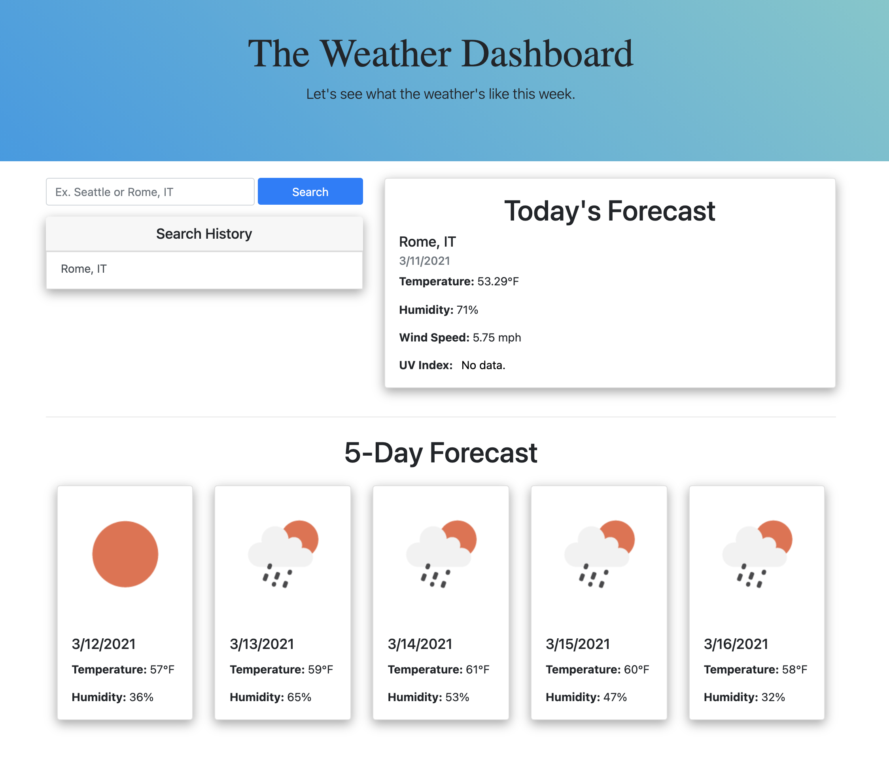

# The Weather Dashboard

Repo: https://github.com/zehrl/weather-dashboard

Website: https://zehrl.github.io/weather-dashboard/ 

---

## Table of Contents
* [Description](#Description)
* [Instructions](#Instructions)
* [Questions](#Questions)
* [License](#License)

---

## Description

The Weather Dashboard is a static site that utilizes the Open Weather API to pull weather data for a given city. The user can search and view a forecast for the current day and 5-days in the future. A search history, utilizing local storage, is visible under the search bar & updated each time the user successfully searches a city.

---

## Instructions

1. Begin by entering a city name into the search bar. You must add the country next to the city if it's outside of the US (Ex. Rome, IT)
2. Submit the search and wait for the content to load.
3. All data displays on the cards. The UV Index will update colors based on the severity for the day. (green = < 3, yellow = < 6, orange = < 8, red = < 11, purple = > 11)

---

## Questions

* My github: https://github.com/zehrl
* Email me at zehrl315@outlook.com if you have any questions.

---

## License

© 2021 Logan J. Zehr

Permission is hereby granted, free of charge, to any person obtaining a copy of this software and associated documentation files (the "Software"), to deal in the Software without restriction, including without limitation the rights to use, copy, modify, merge, publish, distribute, sublicense, and/or sell copies of the Software, and to permit persons to whom the Software is furnished to do so, subject to the following conditions:

The above copyright notice and this permission notice shall be included in all copies or substantial portions of the Software.

THE SOFTWARE IS PROVIDED "AS IS", WITHOUT WARRANTY OF ANY KIND, EXPRESS OR IMPLIED, INCLUDING BUT NOT LIMITED TO THE WARRANTIES OF MERCHANTABILITY, FITNESS FOR A PARTICULAR PURPOSE AND NONINFRINGEMENT. IN NO EVENT SHALL THE AUTHORS OR COPYRIGHT HOLDERS BE LIABLE FOR ANY CLAIM, DAMAGES OR OTHER LIABILITY, WHETHER IN AN ACTION OF CONTRACT, TORT OR OTHERWISE, ARISING FROM, OUT OF OR IN CONNECTION WITH THE SOFTWARE OR THE USE OR OTHER DEALINGS IN THE SOFTWARE.